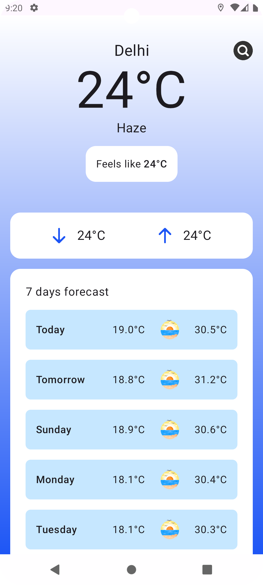
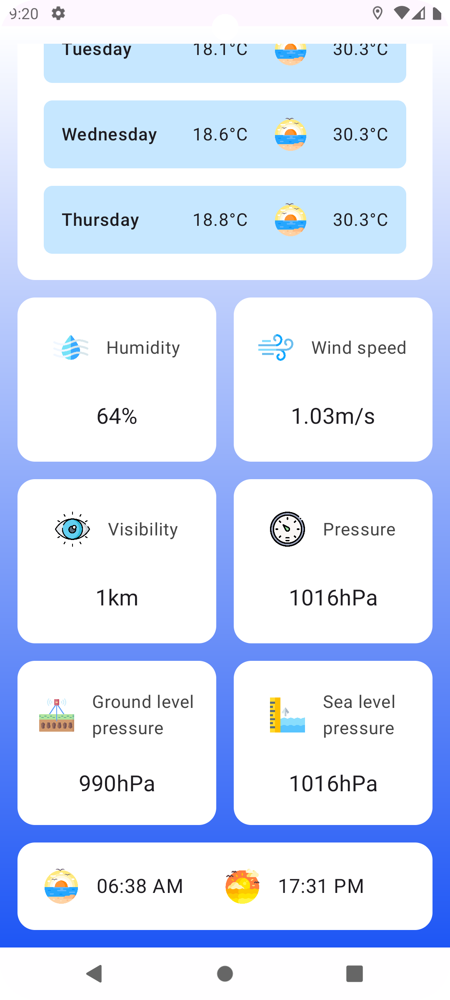
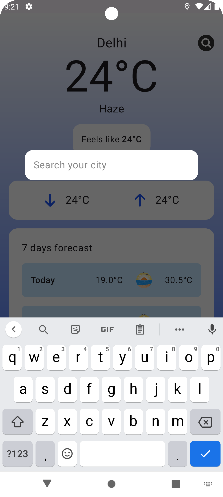

# Android Weather App in Jetpack Compose

## Implemented:

- Custom Splash Screen
- Navigation in Jetpack Compose
- Location permission handling
- Fetching current location (latitude & longitude)
- Loading screen
- API call using MVVM pattern
- Search weather data by city name

## Resources:

- [Weather Data API](https://openweathermap.org/current)
- [Forecast API](https://api.open-meteo.com/v1/)
- [Drawables](https://www.flaticon.com/)

## Screenshots:

    
    
    

